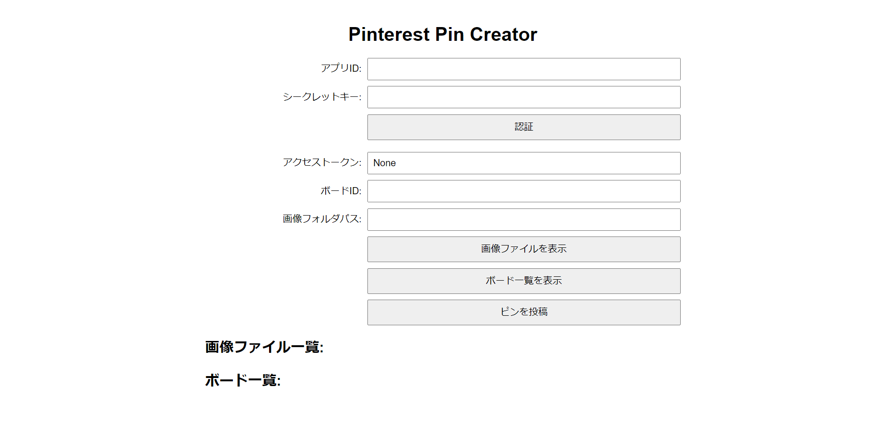

# pinterest-app-sample

Sample application repository using Pinterest API.

## App

### Pinterest Pin Creator

An application that reads image files in a specified folder and posts a Pin using a Pinterest API access token obtained through OAuth 2.0 authentication (Sandbox specification).

> [!IMPORTANT]  
> This app uses the Pinterest API (V5), but you must create a Pinterest business account and register (apply) for an App beforehand.
>
> This is a Pinterest API specification. Specifically, to create/manage boards and pins, an Access Token is generated using the App id and App Secret Key associated with the app in the OAuth 2.0 authentication framework, and the Bearer authentication method is used to send GET/POST request to the endpoint URL using the Bearer authentication method.
>
> Details are described below.
>
> <https://developers.pinterest.com/docs/getting-started/set-up-app/>
>
> To obtain App id and App Secret Key, please go to the apps page and register your App by filling out the required information according to the specified form.

### Screenshot



### Usage

1. Clone project

   Clone project with submodule

   ```bash
   git clone --recursive https://github.com/7rikazhexde/pinterest-app-sample.git
   ```

   Or clone main project and clone submodule

   ```bash
   git clone --recursive https://github.com/7rikazhexde/pinterest-app-sample.git
   git submodule update --init --recursive
   ```

   If you want to update submodule thereafter, do the following

   ```bash
   git submodule update --remote
   ```

2. Set up the environment with your credentials (**app ID** and **secret**).

   Ref: [Quick Start](https://github.com/7rikazhexde/pinterest-api-quickstart/tree/be25168b22b0d2492385546fe22d794bd26d59d0?tab=readme-ov-file#quick-start)

3. Run command.

   ```bash
   poetry install
   poetry run python pinterest_app_sample
   ```

4. Use **app ID** and **secret** to authenticate **OAuth 2.0** and obtain an **access token**.

5. Pin submission with **Board ID** and **Image Folder Path**.
